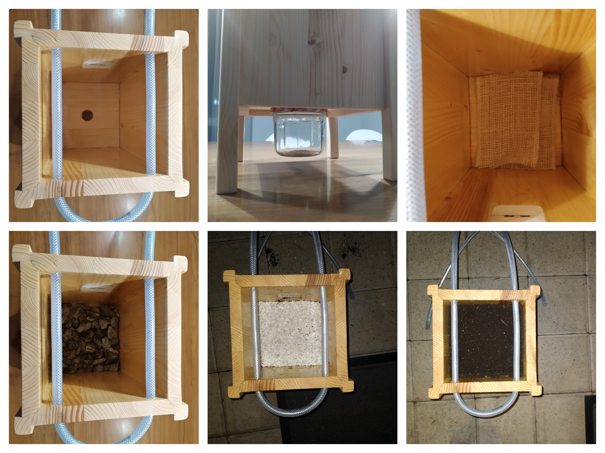
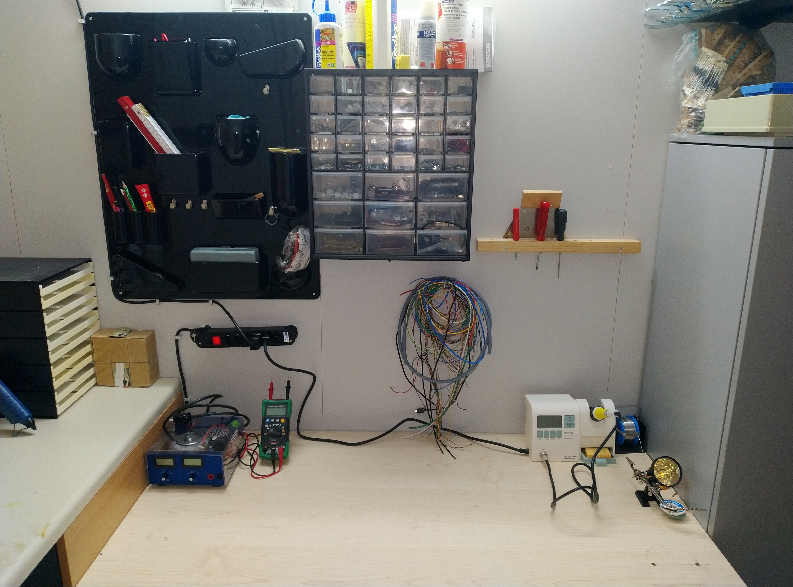
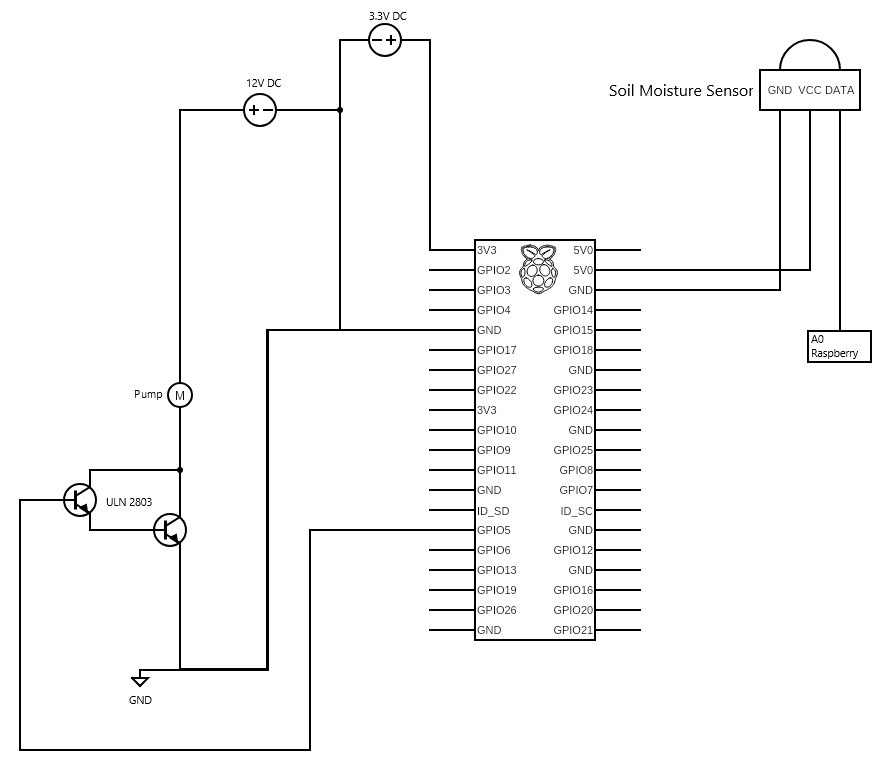
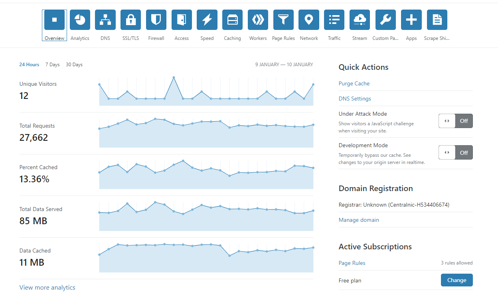
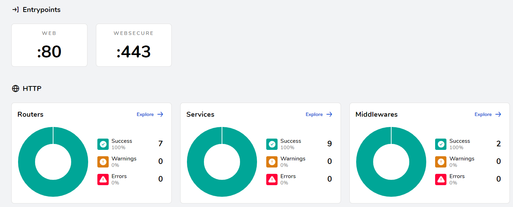
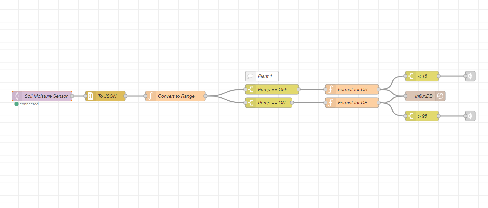
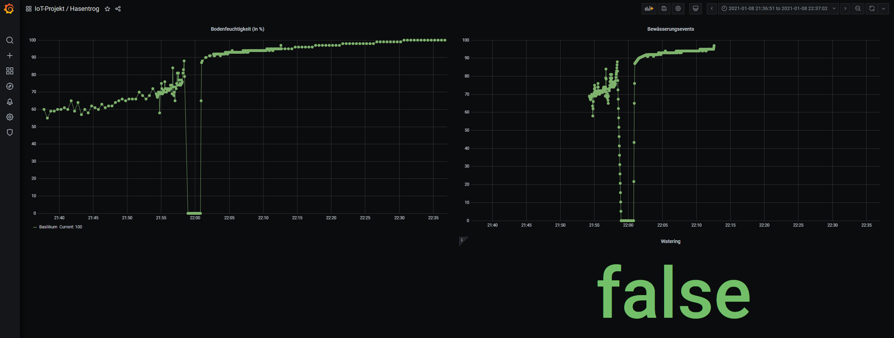

# IoT Engineering
## Project: Autonomous Gardener

## Introduction
This project is part of the [IoT Engineering](../../../fhnw-iot) course.

* 2-person teams, building an IoT system.
* 32 hours of work per person, 1 prototype.
* 10' presentation of the project at Demo Day.
* Slides, source code and setup steps on GitHub.
* Both team members are able to explain the project.

### Team members
* @hapa96, [Pascal Hauser](mailto:pascal.hauser1@students.fhnw.ch)
* @McSquanchy, [Kevin Buman](mailto:kevin.buman@students.fhnw.ch)

## Deliverables
The following deliverables are mandatory.

### Source code

[RaspberryPi/main.py](raspberrypi/main.py)

[backend/mqtt/influxdb/docker-compose.yml](backend/mqtt/influxdb/docker-compose.yml)

[backend/mqtt/mosquitto/docker-compose.yml](backend/mqtt/mosquitto/docker-compose.yml)

[backend/traefik/docker-compose.yml](backend/traefik/docker-compose.yml)

[backend/nodered/docker-compose.yml](backend/nodered/docker-compose.yml)

Node-RED Flows:

[documentation/nodered_flows/flows.json](documentation/nodered_flows/flows.json)

### Process Documentation

#### Hardware
##### Wood Case
In the early steps of the project, we noticed, that the soil moisture sensor is not very acurate, when it is placed on the top of a plant. So we needed a case, where we can put the sensor in the upper half of the soil instead of just place it from top. To have a case, which is fulfilling the needs of our project idea, we decided to create a proper wood-case. Luckily, we have a solid workshop with all the tools at home. The following picture shows you the rough process of the case creation.


To ensure a good water flow, the soil should be structured in different layers of sand, stones and gardener soil. On the bottom of the case, we installed a jar to collect the water. Thanks to this design, it's possible to have the case inside the house or a balcony without dirt or water on the ground. 



##### Electronics
For assembly and development of the electronic parts, we used the little electronic workshop in our basement, which provides the basic tools.


All the electronic parts are collected within a plastic lunch box from IKEA. With this approach, our product can easily placed outdoor and withstand rain and other environmental influences. Following a list of all electronic components that are used:

* [Moisture Sensor](https://wiki.seeedstudio.com/Grove-Moisture_Sensor)
* [12V brushless DC Motor](https://www.banggood.com/Mini-DC12V-3M-Micro-Quiet-Brushless-Motor-Submersible-Water-Pump-p-1182617.html?cur_warehouse=CN&rmmds=buy)
* [Raspberry Pi Zero](https://www.raspberrypi.org/products/raspberry-pi-zero/)
* [Grove Base Hat for Raspberry Pi Zero](https://wiki.seeedstudio.com/Grove_Base_Hat_for_Raspberry_Pi_Zero/)
* [230V/12V 5A AC/DC Converter](https://www.seeedstudio.com/12V5A-Power-adapter.html)
* [Darlington Transistor ULN2803](https://www.conrad.de/de/ratgeber/handwerk-industrie-wiki/elektronik-bauteile/uln2803.html)

The final result looks as following:


Here you can see the circuit for the electronics:




#### Backend

**Strategy**: We decided to use MQTT as our transport protocol for communication between the local device, a Raspberry Pi, and our cloud backend. The backend runs on a Linux VM from [Switch](https://www.switch.ch/engines/).

Since our goal was to have multiple services running on the same host, decided to go for a container-based solution, running on docker-swarm. This made it possible to deploy each service as its own stack, making things much easier to manage.


**Services**: The following section describes each service and its purpose. Each service requires a login. For simplicity, username and password are the same across all of them:

* Username: **admin**
* Password: **iotproject20**

*Note*: each service has its own ```docker-compose``` file and is deployed as a stack using ```docker swarm```.

**Application & Network Security**: We used the free part of [Cloudflare](https://www.cloudflare.com/)'s suite to protect our application. Cloudflare acts as our DNS server. It's important to note that Cloudflare only routes packets on certain ports, while blocking everything else. This put some constraints on our design, for example: Since port *8443* for MQTT is not supported, we had to use *websockets* for all of our MQTT traffic.



**Gateway**: [Traefik](https://traefik.io/traefik/) is an application proxy which routes and forwards incoming requests to specified services. It also acts as a security layer, preventing direct access to any service sitting behind it.  
Using Traefik made it very simple to configure and monitor all services and routes.



[Traefik Dashboard](https://traefik.autonomous-gardener.tech/)

**MQTT-Broker**: We used [Mosquitto](https://hub.docker.com/_/eclipse-mosquitto) as our MQTT broker. As mentioned above, we configured it to use websockets. This way traffic is routed properly by Cloudflare using port **443**. Traefik reroutes packets to port **9001** on the target container.

**Application Logic**: We leveraged [Node-RED](https://nodered.org/)'s extensive featureset to implement our businesslogic. Multiple *mqtt in* nodes subscribe to various topics, process messages, and store them in our database. Its also here where communication from the backend to the local device takes place. Our flows dynamically broadcast trigger messages over mqtt upon fulfilling pre-defined criteria.



[Node-RED Dashboard](https://nodered.autonomous-gardener.tech/)

**Database**: Since soil moisture is measured periodically, we chose to use [InfluxDB](https://www.influxdata.com/) as our database. This makes it very easy to query data in many different ways, which is ideal for monitoring.

**Monitoring**: We went with [Grafana](https://grafana.com/) for our monitoring solution. It can directly access our data inside InfluxDB and allows us to define alle kinds of querys.



[Grafana Dashboard Dashboard](https://grafana.autonomous-gardener.tech/)

#### Frontend

The frontend consists of a Raspberry Pi running ```Raspbian```. The entire application is written in ```Python```. It's capable of taking sensor readings, sending them to our backend, as well as turning the water pump on and off based on commands sent by the backend.  
To increase convenience, we added basic quality of life features. These include:

* If offline, sensor readings are stored in a file. If internet connectiviy ist re-established, the script will first push any locally stored readings to the backend, maintaining a clean record inside the database.
* Measurement frequencies are stored in a ```config.json``` file. In addition, the script fetches the latest config from the backend during startup.
* New configs can be configured in *Node-RED* and deployed remotely. The script will then update its ```config.json``` file with the new settings.
* The pump can be manually triggered using a separate *Node-RED* flow.

### Presentation

[documentation/slides/iot_project_hauser_buman_slides.pdf](documentation/slides/iot_project_hauser_buman_slides.pdf)

### Live demo

* The video for the live demo is available [here](https://tube.switch.ch/embed/9f79759f).
* See [Backend](#Backend) for links to each service.

## Submission deadline
Commit and push to (this) project repo before Demo Day, _11.01.2021, 00:00_.

# Project Idea
[Initial Project Idea](./documentation/Initial-Project-Idea.pdf)